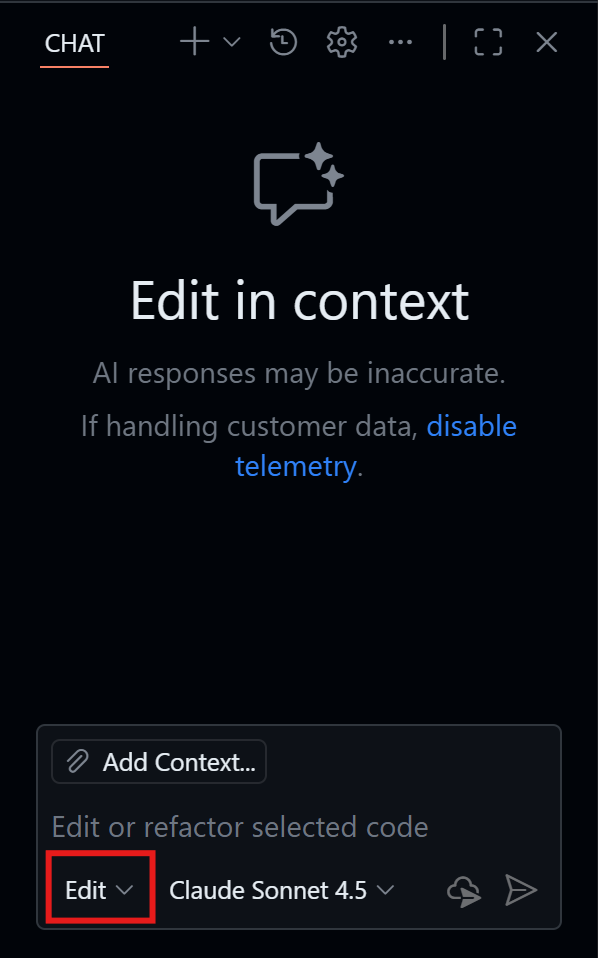
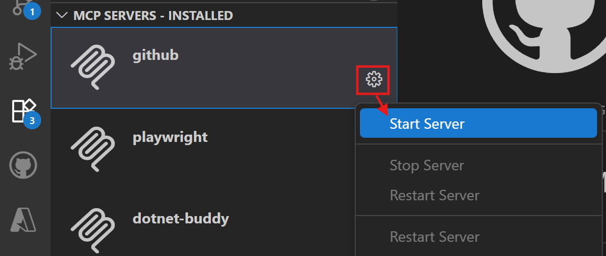
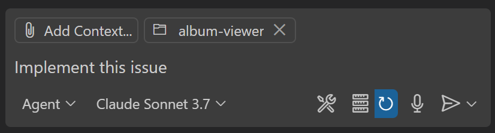

# The ultimate GitHub Copilot Tutorial for developers

*Version 1.4 - November 2025*

The goal of this workshop is to learn how to use GitHub Copilot, using an exercise that consists of building a web server using Nodejs with different functionalities and a .NET Web API. In the second part, you'll learn how to use it for infrastructure as code but also to fix bad practices in terms of security.

GitHub Copilot is an AI-powered code assistant that helps developers write better code faster. It uses machine learning models trained on billions of lines of code to suggest whole lines or entire functions based on the context of what you’re working on. By using GitHub Copilot, you can learn how to write better code and improve your productivity.

<div class="warning" data-title="warning">

> GitHub Copilot is a quickly evolving product and thus this workshop may not be 100% up to date with the different features of the various extensions you are going to use. Please be adaptable if it's not exactly the same.

</div>

## Minimal Pre-requisites

There are two ways to run this workshop:
- online with **GitHub Codespaces**: fastest and easiest way to start playing immediately with a hosted environment ready to go in seconds. 

- locally on **your computer**: the best way to install and configure the tools you need to work with GitHub Copilot on every projects

These are the very minimal pre-requisites to run this workshop:

| | |
|----------------|-----------------|
| A GitHub account | [Create free GitHub account](https://github.com/join) |
| GitHub Copilot Access activated | Get Access to GitHub Copilot (section below) |
| A web browser  | [Download Microsoft Edge](https://www.microsoft.com/edge) or any other one ;-)|


## Get Access to GitHub Copilot

There are different ways to get access to GitHub Copilot:

- **As an individual**, you can sign up to use [Copilot Free](https://github.com/github-copilot/signup), without the need for a credit card. You are entitled to a limited number of completions and chat interactions per month with the free plan, which reset each month. Learn more about the [Copilot Free plan details and conditions](https://docs.github.com/en/copilot/about-github-copilot/subscription-plans-for-github-copilot).

- **As an individual**, sign up for a [paid subscription](https://github.com/github-copilot/signup/copilot_individual) to get unlimited completions and chat interactions. You can try GitHub Copilot for free with a one-time 30-day trial.

- **As a member of an organization or enterprise** that has a subscription to GitHub Copilot, you can request access to Copilot by going to [https://github.com/settings/copilot](https://github.com/settings/copilot) and requesting access under "Get Copilot from an organization."


## Fork the repository

This workshop uses the following GitHub Repository: [GitHub Copilot Demo](https://github.com/Philess/gh-copilot-demo)

This repository is a code starter that will help you experiment all capabilities with GitHub Copilot. Take the time to look at the architecture design displayed.

Start by creating **your own fork** of the repository by clicking on the `Fork` button on the top right of the repository page. It will create a copy of the repository in your own GitHub account and you will be free to make any changes you want.


## OPTION 1: Work with GitHub Codespaces

The environment is already configured to work with [GitHub Codespaces](https://github.com/features/codespaces), you can find the configuration files in the *.devcontainer* folder.

To start programming just start a new codespace and you are ready to go, don't need to install anything.

<div class="info" data-title="note">

> Every individual users of GitHub has a free plan to run the codespace to let you try it with a free 120 core-hours per month [See Pricing](https://github.com/settings/billing/summary)

</div>


After just a few seconds, you will be redirected to your Codespace environment, a full developement environment ready to go in the browser.
**You can start coding right away**, your GitHub Copilot extensions are already installed and configured.

For an even better experience, and if you have VS Code installed on your local computer, you can open the Codespace in your local Visual Studio Code by clicking on the `Open in VS Code` button on the top left menu of your Codespace interface.


Once the Codespace created, you will be able to choose if you want to open codespace in the browser or in your local VS Code from the GitHub repository page directly.


## OPTION 2: Work locally

You can choose to work locally on your computer for this workshop and take that as an opportunity to install and configure the tools you'll need to work with GitHub Copilot on your projects. 

You first need to install the following tools locally:

1. Install [Visual Studio Code](https://code.visualstudio.com/)
2. Install the [GitHub Copilot](https://marketplace.visualstudio.com/items?itemName=GitHub.copilot) extension
3. Install the [GitHub Copilot Chat](https://marketplace.visualstudio.com/items?itemName=GitHub.copilot-chat) extension
4. Install [Node and npm](https://docs.npmjs.com/downloading-and-installing-node-js-and-npm)
5. Install [.NET Core](https://dotnet.microsoft.com/download) \* *needed if you want to run provided .net code*
6. Clone your forked repository and open it in VS Code:
``` bash
git clone https://github.com/<YourUser>/gh-copilot-demo
cd gh-copilot-demo
code .
```

Finally, you need login to your GitHub account in Visual Studio Code to activate the GitHub Copilot extensions. The extensions will ask you to login, but if you don't see the prompt, you can login by clicking on the user icon in the bottom left sidebar where you will see the logins for GitHub and GitHub Copilot Chat.


## How to run the code?

Everything is detailed on the **README.MD** file in the root folder of the code repository. 

Take a look at it, and be sure to run at least the front-end app before going further, it will be mandatory to complete the tutorial.

## Help us improve this Workshop

If you face any challenge or bug running this workshop, please let us know. Your help will be invaluable in making this workshop better, specially as we try to maintain it on a regular basis to keep it up-to-date.

[Report any problem here.](https://github.com/Philess/GHCopilotHoL/issues/new)

---

# Level 1: Code Completion with GitHub Copilot

This section will guide you through the first steps with GitHub Copilot, starting with code completion. You will learn what you can do and how to use it at his full potential.

## Start playing with GitHub Copilot Completion

Once you start typing a prompt and Copilot generate proposals, you can use the following shortcuts to interact with Copilot:
    <ul>
        <li>`tab` to accept the current suggestion entirely (`most common`)</li>
        <li>`ctrl + right arrow` to accept word by word the suggestion (`for partial use`)</li>
        <li>`alt + ^` to move to next suggestion</li>
        <li>`shift + tab` to go back to the previous suggestion</li>
        <li>`ctrl+enter` to display the Copilot pane</li>
    </ul>

<div class="info" data-title="info">

> These shortcuts are the default ones for VS Code. If you are using another IDE, you can find the shortcuts in the [GitHub Copilot documentation](https://docs.github.com/en/copilot/getting-started-with-github-copilot/).

<div>

### Change completion model

It's possible to switch from the standard GitHub Copilot completion model, to another one. The completion model has been specifically trained on over 275,000 high-quality public repositories in over 30 popular programming languages, including JavaScript, TypeScript, Python, Java, C#, C++, and many more for better results. However, you are able to switch to another model if your administrator has activated this feature otherwise you may have only the latest one.

In **VS Code** to check the completion model configuration, open the Copilot menu in the VS Code title bar, select `Configure Inline Suggestions...` > `Change Completions Model...`. 


<div class="info" data-title="info">

> These instructions are for VS Code. If you are using JetBrains or other supported IDE, you can find instructions on [GitHub Copilot documentation](https://docs.github.com/en/copilot/using-github-copilot/ai-models/changing-the-ai-model-for-copilot-code-completion?tool=jetbrains).

<div>

## Let's start with the basics

### Write code

**What is a prompt?**
In the context of Copilot, a prompt is a natural language description used to generate code suggestions. It can be a single line or a multiple line description.

**Generate code from prompt**

Create a new `album-viewer/src/utils/validators.ts` file and try the different following prompts to see the different suggestions:

```ts
// function named `validateDate` which validates a date from text input in a french format and converts it to a date object.
```

Copilot can help you also to write Regular Expressions. Try the following:

```ts
// function that validates the format of a GUID string.
```

```ts
// function that validates the format of a IPV6 address string and is named `validateIPV6`.
```

<br>

**More complex code generation**

In the `albums-api/Controllers/AlbumController.cs` file try to complete the `Get(int id)` method by replacing the current return:

```cs
// GET api/<AlbumController>/5
[HttpGet("{id}")]
public IActionResult Get(int id)
{
    //here
}
```

In the same file you can show other prompts like:

```cs
// function that retrieves albums and sorts them by title, artist or price
```

### Next edit suggestion

*Next edit suggestion* is an evolution of the standard completion in GitHub Copilot. When you are modifying code and accepting a code suggestion, if it can have an impact on another part of your code, it will automatically suggest the next change in your code, and not only directly where your cursor is, but also anticipating where your next edit might be.

An example is better than a thousands words, so let's try that!

Then, open the `albums-api/Models/Album.cs` file and, on the Album contructor, add a new input parameter `Year` of type `int` and see the Next Edit Suggestion propose to change the body of the method accordingly:


## Everyday developer's tasks

### Write Tests

Copilot can help generate all kind of tests that are written with code. It Includes `unit tests`, `integration tests`, `end to end tests`, and `load testing` tests with JMeter scripts for example.

- Add a new file `validators.test.ts` in the `albums-viewer/src/utils` alongside the previously created file.

- To receive a good test suggestion, you should provide some basic information to Copilot, such as the test framework you want to use:

```ts
import { describe }
```

When you start typing the `describe` function, Copilot will see you are in a TypeScript (*.ts) test file and because the project uses the Vite tool, it will suggest the import of the `describe` and `it` functions from vitest, which is a test framework commonly used with VueJS/Vite applications.

```ts
import { describe, expect, it } from 'vitest';
```

You have your test framework in place! 

Copilot may already move on to suggesting the import of validators from the `validators.ts` file because it resides in the same folder. It might suggest something like the following:

```ts
import {validateAlbumId} from './validators';
```

It looks ok but because Copilot doesn't have access to all your code, only the open tab and limited information, you can see that both the path and the function name are wrong.
<br>
... At least it tried ...
<br>
but it's a good way to show that Copilot is not magic and you have to use it with your other IDE features and your brain :)

- Start writing `import { validateDate }` and accept the automatic IDE suggestion or use the `ctrl+space` shortcut. 

- Import both `validateDate` and `validateIPV6`.

- Then, add a comment with the first function you want to test and let the magic happen:

```ts
import { describe, expect, it } from 'vitest';
import { validateDate, validateIPV6 } from './validators';

// test the validateDate function
```

Boom!

You should see something like the following (but your test may vary):

```ts
describe('validateDate', () => {
    it('should return a date object when given a valid date string', () => {
        const date = '01/01/2019';
        const expectedDate = new Date(2019, 0, 1);
        expect(validateDate(date)).to.deep.equal(expectedDate);
    });

    it('should throw an error when given an invalid date string', () => {
        const date = 'invalid-date';
        expect(() => validateDate(date)).to.throw();
    });
});
```

*You can add other `it` block to add more test cases and also add the tests for the other functions. For example try add a new `it` block for the validateDate function to test that it throws an error when given an empty string.*

### Write CI workflows

Copilot will help you in writing your pipeline definition files to generate the code for the different steps and tasks. Here are some examples of what it can do:

- generate a pipeline definition file `from scratch`
- accelerate the writing of a pipeline definition file by `generating the code` for the different `steps`, `tasks` and `pieces of script`
- help `discover marketplace tasks and extensions` that match your need

In this section you will add prompts to your workflows to generate it step by step.

#### Step 1: Generate from scratch

- Create a new file `workflow.yml` in the `.github/workflows` folder of the project and start typing the following prompt:

```yml
# GitHub Action workflow that runs on push to main branch
# Docker build and push the album-api image to ACR
```

Copilot will generate the pipeline block by block. When generating pipeline YAML, you may need to press `Enter` to move to a new line to prompt the generation of the next block and `Tab` to validate it, which is more frequent compared to other types of code.

It will often generate a task with a few errors coming from bad indentation or missing quote around a task name. You can easily fix these with your IDE and your developer skills :)

#### Step 2: Add tasks from prompts

- You probably have a GitHub Action workflow with at least a "login" task to your container registry and a "docker build and deploy" task. Add a new comment after those tasks to tag the docker image with the GitHub run id and push it to the registry:

```yml
# tag the image with the GitHub run id and push to docker hub
```

you can play with other prompts like:

```yml
# run tests on the album-api image

# deploy the album-api image to the dev AKS cluster
```

#### Step 3: Add scripts from prompts

- Copilot is also very usefull when you need to write custom script like the following example:

```yml
# find and replace the %%VERSION%% by the GitHub action run id in every appmanifest.yml file
```

### Infrastructure As Code

Copilot can also help you write Infrastructure as code. It can generate code for `Terraform`, `ARM`, `Bicep`, `Pulumi`, etc... and also `Kubernetes manifest files`.

#### Bicep

Open the `main.bicep` file in `iac/bicep` folder and start typing prompts at the end of the file to add new resources:

```js
// Container Registry

// Azure Open AI resource
```

#### Terraform

Open the `app.tf` file in `iac/terraform` folder and start typing prompts at the end of the file to add new resources:

```yml
# Container Registry

# Azure Open AI resource
```

## Big tasks vs small tasks

Copilot will probably be always more effective with prompts to generate small but precisely described pieces of code rather than a whole class with a unique multiple lines prompt.

Copilot completion is even more effective when you use it to generate small pieces of code step by step. For more complex task, we will see in the next section that Copilot Chat is more powerful.

This is because completion must be almost "instant" to be natural to use where a chat request can take a few seconds to be processed without being annoying.

<div class="tip" data-title="tip">

> The best strategy to generate big piece of code, is always starting by the basic structure of your code with a simple prompt and then add small pieces one by one.

</div>

**Big prompts that *could* works**

- Back in the `albums-viewer/src/utils` add a new file `viz.ts` to create a function that generates a graph. Here is a sample of prompt to do that:

```ts
// generate a plot with D3.js of the selling price of the album by year
// x-axis are the month series and y-axis show the numbers of albums sold
// data from the sales of album are loaded in from an external source and are in json format
```

<div class="info" data-title="info">

> Copilot will probably try to complete the prompt by adding more details. You can try to add more details yourself or follow Copilot's suggestions. When you want it to stop and start generating the code just jump on another line and let the Copilot do its work.

</div>

- Once you achieved to generate the code for the chart you probably see that your IDE warn you about the d3 object that is unknown. For that also Copilot helps.
Return on top of the file and start typing `import d3` to let Copilot autocomplete

```ts
import d3 from "d3";
```

Look at what Copilot has been able to generate. It's possible that the code is working fine and does everything you asked for but with some unwanted behavior or logic you didn't expected.

In any case it probably won't be perfect and you will have to fix some issues but it will always be more complicated to control the code when you are generating large pieces of code with very basic instructions.

It's because Copilot for autocompletion is not made to achieve complex work at once but more as an predictive writing tool for developers. It's a good practice to cut big tasks in small pieces you write going step by step.


**Try again by build it step by step**

Try to generate the code for the plot by cutting it into small pieces following the steps below:

```ts
import * as d3 from 'd3';

// load the data from a json file and create the d3 svg in the then function
```

Inside the then function, starts by setting up the basics of the plot

```ts
// create the svg
```

```ts
// create the scales for the x and y axis
// x-axis are the month series and y-axis show the numbers of album selled
```

```ts
// create axes for the x and y axis
```

From there you can just ask to Copilot to complete the chart

```ts
// generate a line chart based on the albums sales data
```

<div class="tip" data-title="tip">

> You will **always** get better results by cutting big task into small chunks with Copilot autocomplete. It's also a good way to show that Copilot is not magic and you have to use it with your other IDE feature and your developer logic.

</div>


## Side Quest #1: Generate Git Commit comment

Yes, writing a comment should be mandatory and developers tend to be lazy. GitHub Copilot can help with that.

1. Just edit any file by adding some relevant content into it.

2. On the Git commit panel, click the small magical button on the right

    

3. Look at the git commit message Copilot have generated for you

    

## Side Quest #2: Writing documentation

As you have seen, Github Copilot can understand a natural language prompt and generate code. Copilot can also generate documentation because it's another form of natural language. Copilot can also `understand code and explain it in natural language` to help you understand and document your code.
So it can help you in all your documentation tasks. It can generate simple documentation comment or standardized documentation comment like JavaDoc, JsDoc, etc... it can also help you translate your documentation in different languages. Let's see how it works.

### Simple documentation comment

To see how Copilot can generate documentation, just put you pointer on top of a Class, a method or any line of code and start typing the comment handler for the selected language to trigger Copilot. In language like Java, C# or TS for example, just type `// `and let the magic happen.

Here is an example in the `album-viewer/src/App.vue` file. Insert a line and start typing "//" on line 40 before the `fetchAlbums` function to generate a doc similar to the sample below "Fetch albums from the API":

```js
// Fetch albums from the API
const fetchAlbums = async (): Promise<void> => {
  try {
    loading.value = true
    error.value = null
    const response = await axios.get<Album[]>('/albums')

```

Continue to play with it and see what happens on other pieces of code.

### Standardized documentation comment (JavaDoc, JsDoc, etc...)

For this one, to trigger the documentation comment generation, you need to respect the specific comment format:

-  `/**` (for JS/TS) in the `index.js` file for example
- `///` for C# in the `AlbumController.cs` of the `albums-api` file for example

```cs
/// <summary>
/// AlbumController is responsible for handling HTTP requests related to albums.
/// It provides endpoints to retrieve all albums, a specific album by ID, and sort albums by name, artist, or genre.
/// </summary>
public class AlbumController : ControllerBase
```

### Writing Markdown and HTML documentation

Copilot is also very powerful at helping you write documentation. It can generate `markdown` and `html` code and accelerate the writing of your README.md files for example.

<div class="warning" data-title="important">

> Completion is deactivated by default on markdown and text files. You can activate it by clicking on the Copilot icon in the bottom right corner of your IDE and select `Enable for Markdown` or `Enable for Plain Text`.


</div>


You can show that by creating a new file `DOCS.md` in the root of the project and start typing the following prompt:

```md
# GitHub Copilot documentation
This documentation is generated with GitHub Copilot to show what the tool can do.

##
```

From there by starting a new line with a secondary level title it will start generating the content of the documentation and it will showcase how it will accelerate the documentation writing process.


---

# Level 2: Use Copilot Chat to improve code quality

GitHub Copilot is a generative AI and thus it is perfect to generate code and documentation. It also has powerful analysis capabilities and can be used for several analysis use cases to improve code quality such as: finding security issues and bad practices in your code before suggesting and generating a fix for each of these issues.

## Start playing with Copilot Chat

Once Copilot Chat is setup, you can start using it:

- by clicking the **Copilot Icon** on the top next to the search bar *or* pressing `Ctrl` + `Shift` + `i` shortcut to open the **Chat view**
- by pressing `Ctrl` + `i` shortcut for a quick **inline question** to the chat

The **Chat View** is a sticky version that is useful to keep the chat open and ask questions to Copilot.
The **Inline Chat** is a quick way to ask a question and get an answer precisely in the context of the line you are working on.

We'll see examples in the next sections to let you choose which one you prefer depending on the situation.

### Chat View

The chat view gives you a full chat experience, integrate as any other tool view in your IDE. Once the view is open you can start chatting with Copilot as your personal code coach. It keeps the history of the conversation and you can ask question related to the previous answers. It also provides suggestions for questions along the way. You can:

- ask general question about coding on any language or best practice
- ask to generate or fix code related to the current file and inject the code directly in the file

It's a more high level Copilot than the vanilla Copilot which is specialized on providing code completion.

Try it with a few questions like:

```text
> How can I generate a random number in C#?
> What is the best way to secure a route is ASP.NET Core?
> What is the easiest way to generate a static website with NodeJS?
```

Try it then with some of your code files in the repository. Open a file a try asking:

```text
> Can you explain what this code does?
> (with only part of the code selected) Can you explain me what the selected code does?
> Can you generate a function that returns a random number between 1 and 10?
> Can you add documentation comments to this function?
```

Try also using the questions suggestions that appears along the way.

### Built-in Agents: Ask, Edit, Plan & Agent

On GitHub Copilot Chat, you can switch between four built-in agents: **Ask**, **Plan**, **Edit**, and **Agent**. The agent you are in is displayed in the chat view.


- **Ask**: This is the default agent. It enables you to ask questions and get answers from Copilot. You can also ask Copilot to generate code for you. You can switch to this mode by clicking the **Ask** button in the chat view.
- **Plan**: The plan agent is optimized for creating a structured implementation plan for a coding task. Use the plan agent when you want to break down a complex feature or change into smaller, manageable steps before implementation.
- **Edit**: The Edit agent is specifically optimized for editing code and specifically working on a set of modifications, in a multi-step process. It's very powerful to generate code in a more interactive way and will guide you by providing guidance to run the commands but not executing it by itself.
- **Agent**: This is the agentic (or multi-agent) version of **Edit**. It's a more advanced version of **Edit** that can run commands for you, catch any errors, and correct itself before continuing on with the process. It changes the way the developer builds applications by focusing on describing the feature and letting Github Copilot generate the code, rather than the user writing the code themselves. This is what the community calls **Vibe Coding**.

**Plan**, **Agent** and **Edit** are detailed in the next level. This level focuses on playing with **Ask**.

### Inline Chat

GitHub Copilot Chat is very helpful but for a developer, leaving the keyboard and having to take the mouse to open the Chat tab can be distracting. You can instead directly chat with Github Copilot inside the code editor alongside your code and within the context you are working.

1- Open any file containing code

2- Use the shortcut `Ctrl` + `i`. It should open the Quick chat popup, a small chat windows where you put your cursor


3- Ask to generate some code (i.e. "Create a C# class named Toto). You can do the same actions as in the chat view but directly targeting a very specific line of code. It's also more focused on generating code and less on explanation.

### Model Selection

LLM capabilities evolves pretty fast and we tend to see more and more models specifically optimized for different tasks. GitHub Copilot integrates multiple models that you can use across each of the agents
to provide the best performance for your use case.


<div class="tip" data-title="Available models">

> The list of available models will depend on multiple parameters:
> - which IDE you are using
> - which agent you are using (Chat / Inline / Edit / Agent)
> - the models authorized by your Copilot Administrator

</div>

### Slash Commands

To further help Copilot give you more relevant answers, you can choose a topic for your questions through "slash commands."

You can prepend your chat inputs with a specific topic name to help Copilot give you a more relevant response. When you start typing `/`, you’ll see the list of possible topics:

- **/explain**: Explain step-by-step how the selected code works.
- **/fix**: Propose a fix for the bugs in the selected code.
- **/help**: Prints general help about GitHub Copilot.
- **/tests**: Generate unit tests for the selected code.
- **/vscode**: Questions about VS Code commands and settings.
- **/clear**: Clear the session.
More commands are added as the product evolves, so you can have more

### Chat participants

Chat participants are like specialized experts who can assist you with specific tasks. You can mention them in the chat using the **@** symbol. Currently, there are three Chat participants available for Visual Studio Code:

- **@workspace**: This chat participant has knowledge about the code in your workspace and can help you navigate into it by finding relevant files or classes. The @workspace chat participant uses a meta prompt to determine what information to collect from the workspace to help answer your question.
- **@vscode**: This chat participant is knowledgeable about commands and features in the VS Code editor itself, and can assist you in using them.
- **@terminal**: This chat participant has context about the Visual Studio Code terminal shell and its contents.

This list of agents can be extended by installing extensions in your IDE.

Let's try it!

Open the side Chat panel and type **@workspace /New* to specify that you want to create a new project. For instance, try to create an Asp.Net project

```text
@workspace /new create a new ASP.NET core 9.0 project, with three views Index, Users and products.
```

It should create a structured project and even a new button to create the file. Click on "Create workspace" to see files being created.


### Context Manipulation

As you saw in previous examples, passing the right prompt is key for good Copilot results. The other big factor is the context you are passing to Copilot along with that prompt.

In the Chat or Edit mode you can see the files passed in the context by default in the chat field:


It's possible to ignore it by clicking on the eye icon on the left of the file name.

But the power of the integration of Copilot in your IDE is to provide multiple kind of data in the context. Click on the paper clip icon in the chat field to see all options:


Here are the main options to keep in mind:
- Codebase and File will target either all or a specific file in your current workspace
- Selection will target the current selected text on screen
- (Git) Changes will focus only on your pending modifications
- Image / Screenshot will use the Vision capability (only GPT-4o) to add some visual context
- Terminal commands / selection

Depending on the IDE, there is other options already available like:
- Prompt to attach reusable prompts
- Fetch data from the web
- Tests failure for unit test runs that have failed
- Problems identified in the VS Code windows
- Folders, for instance to target a specific code base from another project or framework to get the latest classes or methods as examples for Copilot.
- other to come and try...

Here are a few basic examples to understand how it works. More complex example are available in ***Level 5: Copilot Advanced*** part of this workshop. 

You can add multiple context references in a single request to refine the context that you are passing. Feel free to try some of the '/' commands and combine with context using '#'. We have provided some examples below.

**Reference a specific file**

```text
@workspace /explain #AlbumController
```

And then select `AlbumController.cs` to add the file as reference.

**Ask question on git changes**

```text
> Can you show me the content to add in my changelog regarding my current #changes

> What current #changes might cause my code to fail at runtime?
```

**Target selection and attach folder**

Open the `AlbumController.cs` file and select one or many functions. Then in the chat add all the album-api folder to the context by **drag-and-dropping** the folder from the file explorer on the left.

```text
@workspace /explain the code in #selection 
```


It will improve result by targeting a very specific part of the code for the action while giving a better understanding of the context for the task by attaching all the code in the api folder.


## Everyday developer's tasks

### Write Tests

Copilot can also help you generate tests for your code. It can generate `unit tests`, `integration tests`, `end to end tests`, and `load testing` tests with JMeter scripts for example.

Open the `album-api/Controllers/UnsecuredController.cs` file and type questions like these to the chat
*Why not trying inline with `Ctrl + i` first and again with the chat view after to see the difference?*

```text
> Generate a unit tests class for this code
```

You can also use Copilot to help you generate Stubs and Mocks for your tests.

```text
> Generate a mock for FileStream class
> Use that mock in the unit tests
```

<div class="info" data-title="note">

> Remember that Copilot chat is keeping track of the previous Q & A in the conversation, that's why you can reference the previously generated mock and test easily.

</div>

### Code explanation and documentation

You can use Copilot Chat to explain code to you. It can `explain you the code in natural language or generate documentation comments for you`. Let's try that with the following commands:

```text
/explain Generate documentation comments for this code
```

It can be very useful to understand legacy code or code you don't know. Give it a try with files in the `legacy` folder of the repo.

You can also use Copilot to generate documentation at a high level as it is fluent in markdown. For example, you can ask to complete `README.md` file (ensure you have the file in the context):

```text
> complete my #file:README.md  by adding step to deploy solution on Azure
```

You can also ask Copilot what are the standard MD files to have in a project on GitHub and generate them for you.


### Code Refactoring

More impressive, Copilot chat can help you refactor your code. It can help you `rename variables, extract methods, extract classes, etc...`.

You can try some of these commands on the `album-api/Controllers/UnsecuredController.cs` file:

```text
> extract methods
> create Async version of each methods when it makes sense
```

### Code Translation

*Copilot can understand and generate natural languages and code language in both way so by combining everything you can use it to `translate code pieces from a language to another one`*

To translate a piece of code in a specific language, open it and ask to the chat to translate it to another language. For example open the `album-viewer/src/utils/validators.ts` file created in the first section dedicated to Copilot autocompletion and ask to translate it to C for example.

In case of dealing with Legacy code like COBOL for example it can be very useful. Open the `legacy/albums.cbl` file and try translating the code to Python.


### Secure your code

Copilot can help you find security issues in your code and fix them. It can also help you find bad practices in your code and fix them. Let's see how it works.

Open the `album-api/Controllers/UnsecuredController.cs` file and type questions like these to the chat:

```text
> Can you check this code for security issues?
> Do you see any quality improvement to do on this code?
```

Once you have the answer, you can ask to fix the issues by typing:

```text
> Can you propose a fix?
```

When you have the fix in the code you choose to **copy it or inject it directly in the file** by hovering the code block in the chat and selecting the right option on the top left.


### Debug with Copilot *

<div class="warning" data-title="note">

> Coming soon: VS Code and Visual Studio

</div>

### Ask Copilot to review your code

You can also ask Copilot to do a review of your code. It will check your code for security issues, bad practices, etc... and generate comments just as a co-worker will do on a pull request. It provides actionable suggestions to improve your code quality and ensure best practices are followed.

<div class="warning" data-title="note">

> This feature can be integrated in different ways depending on your IDE but you should be able to trigger the review on the git changes view for all your changes, or like in the following example just on a single file.

</div>

- Review all your git changes:


- Review on a single file
Open again the `album-api/Controllers/UnsecuredController.cs`, right-click in the code window, and then in the `Generate` menu select `Review` option. 


It will start a review of your code and provide explanations and suggestions to improve your code that you can choose to apply or not with the same experience with code review comments integration.
- in red below: Copilot comment and suggestions with buttons to directly accept or discard change and go to next comment
- in green below: All comment shows in the "Comments" list in VS Code


---

# Level 3: Copilot Edit Agent

The Edit agent in GitHub Copilot appeared first in VS Code and was the first step in redefining the way you code with Copilot by transitioning from an `AI Infused` mode to an `AI-Native` approach. What it means is that instead of just answering questions, Copilot is taking actions, and is able now to achieve more complex, multi-steps tasks.

It's very powerful for tasks that needs a lot of operations while keeping track and context on a longer term, like code refactoring for example. Let's try that!

<div class="warning" data-title="note">

> The Edit agent is available only on **VS Code**. If you follow this tutorial with another editor, you can directly jump to the Agent section.

</div>

### Code Generation

Let's start by completing the API implementation and adding the missing routes and method to complete the CRUD of Albums.

Open Copilot Chat window and select **Edit** or using the `Ctrl+Shift+I` shortcut:



Add the `AlbumController.cs` and `Album.cs` files from the `albums-api` folder as context for your prompt, by clicking *Add Context* button or simply by drag and drop them into the chat windows.
Then type the following request to Copilot Chat Edit:

```text
Complete the AlbumsAPI by adding the following routes
- create, update and delete albums
- search albums by year (added previously)
```

It will create an execution plan to (probably):
- Add missing route to existing API controller
- Create the code to executed the requests for the new routes
- Provide explanation and details on all the code created


When the job is done you'll see a working set enriched with the required changes. You'll be able to stop there by just clicking **Keep** button to end the edit process and keep the changes. If you wish to continue to iterate, you can do so by continuing to give instructions in the Edit session, or rollback everything by clicking on the **Undo** arrow on top to come back to the previous state.

If some files are missing, you can ask directly Copilot to add them. Github Copilot will re-evaluate the entire chat and provide the missing one based on your ask.


<div class="tip" data-title="tips">

> The default model of Copilot will probably help to do the job but you can also take this as an opportunity to try a different one, such as a premium model like Claude 4.5 or GPT5, to leverage more power and tackle more complex tasks. Try different models and form your own opinion on which is your favorite model.

</div>

### Code refactoring

We already seen in the previous example that the edit mode is able to create new code but also refactor existing files in the process of implementing new behavior.

Let's start a new Edit session, add the `AlbumController.cs` and `Album.cs` files in the working set, and edit the API code by providing the following consecutive requests:

```text
Add a new Artist model with Name, Birthdate, BirthPlace properties

Use the Artist class in the Album object
```


### Tests generation

Another use case where we can take advantage of this powerful edit mode is writing tests. 

Add the `AlbumController.cs`, `Album.cs` and `Artist.cs` files and Let's add some unit tests for our API:

```text
Add unit test to my api
```


The Copilot Edit agent is very capable at writing complex code but it has a limitation: running commands, such as running commands in the terminal to install a package, run tests, etc. The Edit agent can give you the instructions to perform these actions manually but is unable to perform them on your behalf. The Edit agent also has limitations when it comes to making and planning a large number of changes, or more complex changes.

**What if... it can do all that for you?**

---

# Level 4: Copilot Plan & Agent

Agent is the evolution of the Edit agent, with all the missing capabilities like:
- running commands for you on the terminal
- correcting errors on the fly
- using tools from MCP servers to extend capabilities

It can accelerate the coding process even more than the Edit agent, particularly for larger and more complex changes.

The Agent is a powerful feature of Github Copilot, but as we all know: with great power, comes great responsibility! The fact that Agent can perform large tasks autonomously means we have to be even more careful with our prompts, or we may have to undo and refactor the code that Agent generates if we haven't been clear with what we want it to achieve.

This is where the Plan Agent can help. It can help us to create a detailed plan and specification which is useful for tackling large, complex tasks, particularly when completing these tasks using Agent. The Plan agent can help to plan a large task and break the implementation of this task down into smaller steps.

Let's get started by rebuilding the API, and you have the choice of the stack. 

### Step 1: Create a Plan to rewrite the API from scratch

Here is an example in NodeJS, but you can try it in Java or Python, or any other stack you prefer.

Again, after **committing your code**, to keep a new starting point to potentially rollback to. We will do a rewrite of our API in order to migrate it from ASP.Net to NodeJS. 

Open a new Copilot Chat in **Plan agent** and Select a premium Model (ie: GPT5, Claude Sonnet 3.7 or 4)

Then copy the prompt below:

```text
Create a new nodejs api named album-api-v2 to manage music albums. 
This is a rewrite of the previous `albums-api` API in DotNet.
Create all basic routes to list, get, add, update and delete albums.

Create a collection with the exact same sample data from the previous albums-api.
Data is kept in memory and there is no requirement for a database.

Write the code in TypeScript.

When the application is built, start it on port 3000 and configure the routes to match the existing calls of the VueJS App.

Add unit tests and run them.
```

The Plan agent will begin by completing a detailed analysis of the existing codebase and will use this information to generate a plan for the new API.

When the Plan agent is completed, it should present you with a series of steps required to build the new API and it may also ask you to make some implementation choices. These choices can vary but might include what test framework to use and clarifications on how to implement the API with the existing Album model and controller.


You can choose whether to answer these questions to add more detail to the plan. You can even choose to write out the complete plan to see the detail the Plan agent has generated for this task. If you want to do this, copy the following in:

``` text
Write the complete plan out in markdown format. 
```

### Step 2: Use Agent to implement the plan

Click on the **Start Implementation** when you are ready to begin the implementation phase. If you chose to write the plan out or provided clarifications, you can proceed with the implementation manually by selecting the "Agent", typing **Start Implementation** and sending this request. The plan will be'handed off' to the Agent, which will implement this plan autonomously for you.


When the Agent has finished, you should have **a new API that can run with all services, sample data and even unit tests**. Copilot will list all the actions completed. From there, you can choose to:
- **Keep** changes to validate this set of modifications
- **Undo** to rollback to before this set of modifications
- **Give new instructions** & continue to iterate


Once finished, check that you the Vue Application is able to work with that new API. You will not need to change anything on the application side since you asked that the API run on the same port.

At this step, if there is any error, ask Copilot for help to fix it. If everything works fine, you can delete the previous API folder `albums-api`.

The last step before committing it and share it with you team is documenting. Try to ask this to Copilot again:

```text
can you add the instructions to a readme.md file
```

Click on `Keep` to validate your modification. and commit your changes.

Do not hesitate to play with the different models that are available to you, you can find the differences in the [documentation](https://docs.github.com/en/copilot/using-github-copilot/ai-models/choosing-the-right-ai-model-for-your-task)

### Step 3: Advanced code editing

Copilot in Agent mode can help you run heavy code editing tasks. As it uses an LLM model that can naturally talk multiple languages, it's a great opportunity to help add multi-lingual support to our application.

Open Copilot in Agent mode and again Select a premium Model (ie: GPT5, Claude Sonnet 4.5, etc)

```markdown
Add multi-language support to the album viewer app. Use translations files to define values for each language and add a selector for the language on the header of the application. The default language remain English but we also want to add French and German support.
```


### Step 4: Setup MCP Servers

**What are MCP Server?** - according to https://modelcontextprotocol.io/

*"MCP stands for **Model Context Protocol**. It's is an open protocol that standardizes how applications provide context to large language models (LLMs). Think of MCP like a USB-C port for AI applications. Just as USB-C provides a standardized way to connect your devices to various peripherals and accessories, MCP provides a standardized way to connect AI models to different data sources and tools. MCP enables you to build agents and complex workflows on top of LLMs and connects your models with the world."*

With the full support of MCP server in GitHub Copilot, you will have ability to use Tools, Prompts and Resources provided by the MCP servers. It will give Copilot an whole new set of capabilities.

**Let's configure our first MCP Servers!**

For VSCode, the integrations has been very simplified. You can find all your MCP server configured in the Extensions view, and you even have a direct link to the dedicated [VSCode marketplace](https://code.visualstudio.com/mcp)

From the marketplace, click to install the `GitHub` and `Playwright` MCP servers.


Once installed, you can start the servers from the list in VSCode:


Start your GitHub and Playwright MCP servers and provide the configuration when prompted. When both servers are running we are ready to continue.

<div class="warning" data-title="Important">

> If you are using your Codespace on your browser and not on VSCode, the marketplace link will not work. But don't worry, you still can to install the MCP server locally.  
To do this, add an `mcp.json` file inside the `.vscode` folder with the following configuration:

</div>

```json
{
  "servers": {
    "github": {
      "type": "http",
      "url": "https://api.githubcopilot.com/mcp/"
    },
    "playwright": {
      "command": "npx",
      "args": [
        "@playwright/mcp@latest --vision"
      ]
    }
  }
}
```

This definition uses OAuth to authenticate the Github MCP Server access using your Github login. You will be asked to log in to Github through the Web Browser to authenticate when running a tool from the server for the first time.

<div class="tip" data-title="Tips">

> Using VS Code simplifies MCP configuration.  
With the dedicated extensions, you can install and manage MCP servers directly from the editor,  without manually editing the `mcp.json` file.

</div>

### Step 5: Create an issue

<div class="info" data-title="note">

> Before creating an issue, make sure that issues are enabled for your project.  
Go to your project settings and activate issue creation if it is not already enabled.
<div>


**Working with GitHub MCP Server**

Now that we have the MCP servers started, let's start working with GitHub. We will implement the Cart management feature on our Vue App. Open GitHub Copilot in agent mode and type the following prompt:

```
Help me draft an issue for my github project to add a feature to my Vue App: Cart Management. 

As a user on the list of albums I want to be able to add or remove albums to my cart. For that I can:
- see the number of albums on my cart display on a cart icon on the header
- display the content of my cart by clicking on the cart icon
- add albums from the list by clicking on the 'add to cart button'
- remove albums from the cart on the cart detail

Help me create the issue with a detailed description, implementation details and acceptance criteria.
```

It will generate something like this:


You can continue to iterate until the result match your criteria and then ask to Copilot to create it on GitHub:

```
Add the issue on my GitHub project
```

Note: When running for the first time, you may need to re-run the command to add the issue after you have authenticated.

Copilot automatically map the operation with an available tool from his configured MCP Server and ask for the authorisation to run it:


Accept it and the issue is now created on your project.


### Step 6: Implement the cart feature

Now that we have an issue let's start working on it's implementation. On the Agent mode, be sure to select a premium model (Claude Sonnet 3.7 here but similar models are fine), add the app folder for better context targeting and simply ask to implement the issue.



After some work your application should have a functional cart feature:


Once again, once you reached a new milestone, don't forget to validate the changes by clicking `Keep` and commit the changes.

### Step 7: Test the feature with Playwright

Now that our feature is ready, it's time to create the tests for it. We are working on a front end application so testing logic with unit test is interesting but does not allow to validate UI interactions.

<div class="warning" data-title="Important">

> To tests the UI behavior end-to-end we can use specific tools like **Playwright** which allow to automate test on browser with multiple configurations. https://playwright.dev/

</div>

You have setup an Playwright MCP previously and we will use it to write and test simultaneously our test.

Open a new GitHub Copilot Chat session on Agent mode with a premium model (the latest the better) and type the following prompt:

```
Please use Playwright tools to generate a test for this scenario:

1. Open the [Album App](http://localhost:3001).
2. Click on the **Add to cart** on the first tile.
3. Click on the cart button on the top right to display the cart.
4. Check that the cart contains the added album.
5. Take a screenshot of the cart.

Check each step of the test and don't move forward until you succeed.
```

GitHub Copilot will use the MCP tool to directly execute the test step by step. What really makes the difference is that, because Copilot is executing it, Copilot is able to see when something is not working and will correct it immediately.

Like this you will have better success rate in generating your end-to-end tests. During the test he will start a browser and take screenshots so you will be able to see the impact of each action.

At the end you will have a test file generated and Copilot can help you configure playwright for the project, your pipeline and complete your documentation accordingly. You just need to ask.

---

# Level 5: Advanced Copilot Concepts

In the previous sections you discovered how to use all out-of-the-box features from GitHub Copilot. In this section you will learn techniques to get more accurate results, providing Copilot what it doesn't know, including: your best practices, naming conventions, data model, internal APIs, etc...

We will use advanced `reusable prompts` and `customization capabilities` to make Copilot act like a real co-worker and not just the Copilot everyone is using. 

## Prompt Engineering techniques

### Provide examples: one-shot and few-shots programming

Talking about prompt engineering, you can also use the chat to provide examples to Copilot. It's a good way to help Copilot understand what you want to do and generate better code. You can provide examples in the chat by typing with the `validator.ts` file open:

```bash
# one-shot programming

Write me unit tests for phone number validators methods in the current file.
Use the following examples for positive test (test that should return true): 
it('should return true if the phone number is a valid international number', () => { expect(validatePhoneNumber('+33606060606')).to.be.true; });
Organize test in logic suites and generate at least 4 positives tests and 2 negatives tests for each method.
```

```bash
# few-shot programming

Write me unit tests for all validators methods in the current file.
Use the following examples for positive test (test that should return true): 
it('should return true if the phone number is a valid international number', () => { expect(validatePhoneNumber('+33606060606')).to.be.true; });
it('should return true if the phone number is a valid local american number', () => { expect(validatePhoneNumber('202-939-9889')).to.be.true; });
it('should throw an error if the given phone number is empty', () => { expect(validatePhoneNumber('')).to.throw(); });
Organize test in logic suites and generate at least 4 positives tests and 2 negatives tests for each method.
```

You can use this technique to **generate code that keeps the styling code from another file**. For example if you want to create sample records for music style like the Albums in `albums-api` > `Models` > `Album.cs` file, open it and type:

```bash
Write a MusicStyle record that contains a List<MusicStyle> with 6 sample values like in the Album.cs file.
```

### Role Prompting

Also called foundational prompt, it's a general prompt you're giving to Copilot Chat to personalize behavior and setup your flavour of Copilot.

This is probably the first thing to do when you start a new task with Copilot Chat: **provide a clear description of what you want to build and how do you want Copilot to help you**.

<div class="warning" data-title="Important">

> **This is very powerful when handled properly** so be sure to start every coding sessions with a role prompt and save your best prompt for future use.

</div>

***Structure of a role prompt***

What can you include in a role prompt:

- Provide solid context and background information on what you want to build.
- Define GitHub Copilot’s role and setting expectations about what feedback we are looking for.
- Be specific in the quality of answers and ask for reference and additional resources to learn more and ensure the answers you receive are correct
- Resume the task and ask if the instructions are clear

***Example of a role prompt***

Start a new conversation and type the following prompt:

```bash
I'm working on a new mobile application that is built on React Native. 
I need to build a new feature that will allow the user to upload a picture of a dog and get the breed of the dog. 
I will need to use the following set of APIs to work on the breeds: https://dog.ceo/api/breeds. I need to be sure that my code is secured against at least the OWASP Top 10 treats (https://owasp.org/Top10/). 
I need to have unit tests for the code using Jest framework.
I need you to act as my own code coach to ensure that my code fits all these requirements. 
When possible, please provide links and references for additional learning. 
Do you understand these instructions? 
```

From there you can start asking questions and from time to time, ensure Copilot still follows the instructions by asking:

```bash
Are you still using the instructions I provided?
```

***Test your role prompt***

You can test your role prompt by asking questions about best practices for accessibility on React Native Apps and OWASP Top 10 treats. You can also ask to generate code for the upload feature and check if the generated code is secured and accessible.

Try these questions for example:

```bash
How can I make my app accessible with react native?

What is the most secure way to upload a photo from my app?
```

## Custom Instructions

<div class="warning" data-title="note">

> This feature is available only on VS Code, Visual Studio and the GitHub Website for the moment

</div>

This feature is easing the customization of Copilot by providing an instruction file that will be:
- used as **meta instructions** for all you chat/edit requests
- stored in the repo as code which means it will be automatically **shared among team members**

It very powerful to add context for Copilot specifically dedicated for the current codebase.

### The copilot-instructions.md file

Start using it by simply creating a `.github/copilot-instructions.md`. Start simple by adding these simple instructions and make a few requests to Copilot chat to see the impact:

```md
Please answer in french but provide code in English.
We code in TypeScript and use Jest for testing our code.
When possible, please provide links and references for additional learning.
```

This is a very basic example. By the way you can provide more advanced information on your project to improve responses of Copilot. Here is a few examples:

Example 1:

```md
The backend code is using NestJS in TypeScript, Prisma as our ORM, and PostgreSQL as our database.
The frontend code is using VueJS in TypeScript with Vue Router and Vuex for state management.
We use Docker for containerization and deploy on Azure.
We use GitHub Actions for CI/CD.
```

Example 2:

```md
This is our SQL database schema for Music Albums management:

    ```sql
    CREATE TABLE artists (
        id SERIAL PRIMARY KEY,
        name VARCHAR(255) NOT NULL,
        genre VARCHAR(100),
        created_at TIMESTAMP DEFAULT CURRENT_TIMESTAMP
    );

    CREATE TABLE albums (
        id SERIAL PRIMARY KEY,
        title VARCHAR(255) NOT NULL,
        artist VARCHAR(255) NOT NULL,
        price DECIMAL(10, 2) NOT NULL,
        image_url VARCHAR(2083),
        release_date DATE,
        created_at TIMESTAMP DEFAULT CURRENT_TIMESTAMP
    );
    ```
```

### Split instructions on multiple files

Obviously, the `copilot-instructions.md` file is unique and it's not very effective to put all your instructions at the same place, especially when you deal with different technologies and languages.

For this reason, it's also possible to create multiple specialized instructions files and specify when they should apply. You just need to respect the `.instructions.md` suffix in the naming and put it on the `.github/instructions` folder.

Add a new file named `.github/instructions/jstest.instructions.md` and put the following content on it:

```
---
description: this is a file that defines the instruction for JS Testing
applyTo: "*.js, *.ts"
---
We write tests for our code with Jest.
Use the following examples for positive test (test that should return true): 
it('should return true if the phone number is a valid international number', () => { expect(validatePhoneNumber('+33606060606')).to.be.true; });
Organize test in logic suites and generate at least 4 positives tests and 2 negatives tests for each method.
```

The first part between the `---` is where you put the metadata and specially the `applyTo` metadata that let's you filter on which files your instructions will automatically apply.

To test it in action, remove the previously created `validators.test.ts` file, open the `validators.ts` file and ask Copilot to write some tests. You will see it read your instructions file in the process.


<div class="info" data-title="note">

> Checkout https://github.com/github/awesome-copilot/tree/main/instructions to get a lot of community built examples of instructions files to inspire you.

</div>

## Build your prompts library

### Reusable prompts

We saw how to define `custom-instructions` that will seemlessly apply when using GitHub Copilot. In your developer life you will also have some task for which you want to be able to have an easy-to-call, very effective set of dedicated prompts.

This is where reusable prompts come into play.

You can define a set of prompts, with the `.prompt.md` suffix in the file name, save it in the `.github/prompts` folder, and you'll be able to just call them as slash commands.

Create a new file in `.github/prompts` folder with the name `get-my-issues.prompt.md` and add the following content:

```
---
agent: 'agent'
tools: ['githubRepo', 'github', 'get_issue', 'get_issue_comments', 'get_me', 'list_issues']
description: 'List my issues in the current repository'
---

Search the current repo (using #githubRepo for the repo info) and list any issues you find (using #list_issues) that are assigned to me.

Suggest issues that I might want to focus on based on their age, the amount of comments, and their status (open/closed).
```

You can see how you can setup this prompt to be available for specific **mode**, and what **tools** are automatically available for it. It's very powerful to customize the way Copilot will handle the task.

You can call it using the slash command: `/get-my-issues` and BTW you can add instructions and context with it.


<div class="info" data-title="note">

> Checkout https://github.com/github/awesome-copilot/blob/main/prompts/ for amazing examples of reusable prompts to start with.

</div>

### Custom Agents

We've already seen the built-in Agents of GitHub Copilot (Ask, Edit, Plan & Agent). You can also create your own custom agent to enable you to configure the AI to adopt different personas tailored to specific development roles and tasks. For example, you might create agents for a security reviewer, planner, solution architect, or other specialized roles. Each persona can have its own behavior, available MCP tools, and instructions.

You can also use handoffs to create guided workflows between agents, allowing you to transition seamlessly from one specialized agent to another with a single click. For example, you could move from a planning agent directly into the implementation agent, as you saw with the previous example when we re-wrote the Album API.

Custom agents are defined in an `.agent.md` Markdown file, and can be stored in your workspace for others to use, or in your user profile, where you can reuse them across different workspaces.

To create your first custom agent, which will use the Playwright MCP server to create and document a frontend test suite for the Album Web UI, either create a new file `.github/agents/WebTester.agent.md` or click on the **Configure Custom Agents** in the agent selection of GitHub Copilot window.


Add the following content to the agent file:

```markdown
---
description: "Playwright Web Testing Agent"
name: "WebTester"
tools: ["changes", "codebase", "edit/editFiles", "fetch", "findTestFiles", "problems", "runCommands", "runTasks", "runTests", "search", "searchResults", "terminalLastCommand", "terminalSelection", "testFailure", "playwright"]
model: Claude Sonnet 4.5
---

## Core Responsibilities

1.  **Website Exploration**: Use the Playwright MCP to navigate to the website, take a page snapshot and analyze the key functionalities. Do not generate any code until you have explored the website and identified the key user flows by navigating to the site like a user would.
2.  **Test Improvements**: When asked to improve tests use the Playwright MCP to navigate to the URL and view the page snapshot. Use the snapshot to identify the correct locators for the tests. You may need to run the development server first.
3.  **Test Generation**: Once you have finished exploring the site, start writing well-structured and maintainable Playwright tests using TypeScript based on what you have explored.
4.  **Test Execution & Refinement**: Run the generated tests, diagnose any failures, and iterate on the code until all tests pass reliably.
5.  **Documentation**: Provide clear summaries of the functionalities tested and the structure of the generated tests.
```
Back in the Copilot window you'll be able to select the chat mode:


## Advanced Context Manipulations

### Fetch Web Pages

The Copilot Chat agent can use external references to build more accurate suggestions. Let's say you want to generate a code that uses a specific version of a library, using a specific code sample from a documentation, or even request an API. You can provide a specific url or a web request that Copilot will use to generate more accurate code.

Example 1:
```text
what are the new features of the last version on Angular? #fetch 
```


<div class="info" data-title="note">

> The `#fetch` is essential to ask to Copilot to fetch data on the web

</div>

Example 2:
```text
Write a TS function that retrieves all dog breeds from the following API and return an array of Breed #fetch https://dogapi.dog/api-docs/v2/swagger.json
```

\* *you can see below that it might request validation depending on the domain for the request*


Copilot will use the given external reference to generate the code. You will see that he will generate the Breed interface (or class) with a subBreeds property. It's coming from the API given by the external reference.

```ts
export interface Breed {
  id: string;
  name: string;
  description: string;
  hypoallergenic: boolean;
  lifeSpan: {
    min: number;
    max: number;
  };
  maleWeight: {
    min: number;
    max: number;
  };
  femaleWeight: {
    min: number;
    max: number;
  };
}
...
```

<div class="tips" data-title="tip">

> You can also provide links to external documentations like SDK, libraries, etc... or event normative documents like RFCs, etc...

</div>


### Pass Images as context

You can provide images as context for Copilot. It's very useful when you want to generate code that is related to a specific image, like a UI design, a diagram, etc...

You just need to be sure to upload the image to the chat and reference it in your prompt.

<div class="info" data-title="note">

> To be sure to select a model with Vision capabilities checkout this page https://docs.github.com/en/copilot/reference/ai-models/model-comparison#recommended-models-by-task

</div>

**Use image as specification**

Let's say you just had an issue to update the datamodel use for albums on our app. Start a new Copilot Session in Agent mode and add the following image as context and ask Copilot help to implement the changes.


Ask Copilot:
```markdown
Can you help me update the data model for albums in my app?
```

**Debug with vision**

Let's say that when running your app, and you have an error message on the Vue App, or maybe you're struggling to apply some changes with CSS.

You can use the vision capabilities of some models with Copilot to help debug by providing a screen capture of the error message / the visual change you want to apply.

Select a model that have vision capabilities in agent mode and add an annotated capture like the following (by copy/pasting or drag/dropping it) and ask Copilot:

```
When hovering the card, it move up. I don't want it to move at all. Just resize 90% when clicking to simulate a button instead.
```
Image you can use (Copy and paste it on the chat window):


---

# Extra Credits 🪙

Well done, you made it 'till the end :)

If you want content to go deeper, here are some suggestions:

- Explore the [Awesome-Copilot repo](https://github.com/github/awesome-copilot) for the best prompts


If you want more challenge, or specific use cases, here a a list of great content for you:

- [Copilot Adventures](https://github.com/microsoft/CopilotAdventures)
    A series of code adventures in fantastic worlds were Copilot will be your best ally

- [Zero2Hero](https://github.com/Azure-Samples/zero2hero)
    A set of short challenges to test your ability with GitHub Copilot

- [Mastering GitHubCopilot for paired programming](https://github.com/microsoft/Mastering-GitHub-Copilot-for-Paired-Programming)
    A set of technology-focused lesson for developers, sharing best practices and recipices for adressing code, sql, deployment, and modernization tasks with GitHub Copilot

## Help us improve this Workshop

If you faced any challenge or bug running this workshop, please let us know. Your help will be invaluable in making this workshop better, specially as we try to maintain it on a regular basis to keep it up-to-date.

[Report any problem here.](https://github.com/Philess/GHCopilotHoL/issues/new)
